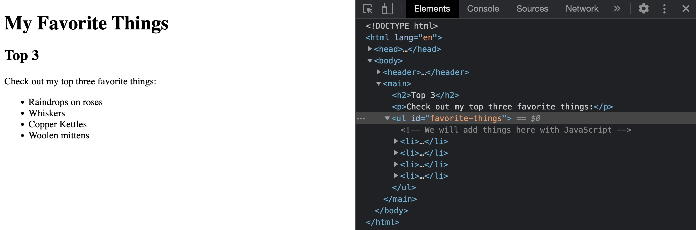

# DOM Tutorial

What is the DOM? From the reading you learned that the DOM is a hierarchical, tree-like structure of parent & child elements. You also learned that we can interact with the DOM using JavaScript in the browser. 

In the reading, we looked at a variety of ways to interact with the DOM using JavaScript. In this tutorial we'll get practice using the developer tools to view the DOM as well as focus in on a few key JavaScript DOM related methods and properties that really earn their keep. 

## Explore the DOM

Let's start by examining the structure of the HTML and the DOM using the provided  `index.html` file. Open the file in your browser, then use the F12 key to open the developer tools. 

In the Elements view, you can use the arrowheads to expand & collapse the DOM tree structure to explore the parent & child relationships between the HTML elements. 


You can see that the root `html` node has two child nodes `head` and `body`. Just like in a family tree, these are *sibling* nodes. Similarly, the `body` element also has two child nodes `header` and `main`.

Expand the `header` node and you can see it has a single child `h1`. Expand the `main` node and you can see that it has three child nodes: `h2`, `p`, and `ul`. The `ul` also has a single child node, a comment.


Understanding this parent and child structure of the DOM is useful when interacting with the DOM using JavaScript.


## Using JavaScript to Update the DOM

Now that we have a feel for the DOM structure, we can use JavaScript to view, navigate, and change that structure. In this tutorial, we'll use JavaScript to dynamically add some favorite things to the web page. 

To get started, open the `script.js` file. Notice that it contains an array of the favorite things to add. We'll come back to that later, first we need a way to interact with the DOM in JavaScript. This is done using the browser's built-in `document` object. We can use that `document` object to get the target location on the DOM where we want to add our new elements. 

Earlier we saw a `ul` element already on the DOM through the developer tools. You can also see this is setup in the `index.html` file. We want to add our favorite things to this `ul` as separate `li` elements. 

```
    <ul id="favorite-things">
      <!-- We will add things here with JavaScript -->
    </ul>
```

Notice that the `ul` has an `id` attribute. The most direct way to access an element is by id using the `getElementById` function. 

Add the following code into `script.js`:
```
let ul = document.getElementById('favorite-things');
```

Now we have a reference to the location on the DOM where we want to add our favorite things. The next step is to create the new elements and add them to the DOM.


### Adding Elements

Before we can add each of our favorite things to the DOM, we first need to create a new `li` element that contains the text for the favorite thing we want to add. 

We can create a new element using the `createElement` method, passing in a string for the type of element to create. We can then set the text content of that element using the property `innerText`.

```
// Create the new li element
let newListItem = document.createElement('li');

// Set the text content to our favorite thing
newListItem.innerText = 'Raindrops on roses';
```

When we create an element, it is not visible in the browser until we add it to the DOM. There are many ways to add an element to the DOM, but one of the most straight forward ways is to use the `appendChild` method. This method is called on the *parent* element, passing in the new *child* element to add. 

In this case, we will use the `ul` we got from the DOM earlier.
```
ul.appendChild(newListItem);
```


Great work so far. We've got one item added, but we need to add three. 

Remember that array of favorite things at the top of our `script.js` file? Instead of repeating the code that we just wrote for each item, we can use a loop to iterate over the array.

First, add a `for...of` loop that will iterate over the `favoritesList` array:
```
for (let favorite of favoritesList){
  // We'll move our earlier code here
}
```

Next, move the 3 lines of code we wrote earlier inside the loop, changing the string literal `Raindrops on roses` to the loop variable `favorite`.
```
for (let favorite of favoritesList) {
  // Create the new li element
  let newListItem = document.createElement('li');
  // Set the text content to our favorite thing
  newListItem.innerText = favorite; 
  // Add it to the DOM
  ul.appendChild(newListItem);
}
```




### Removing Elements

Things are looking good. However that heading says "top 3". It looks like we have one too many in our list. Let's fix that by removing 'Copper Kettles' from the list. 

We can remove an element by using the `removeChild` method. This method must be called on the *parent* element, passing in the specific child element to remove. We already have a reference to the parent `ul`, but we need a reference to the specific child `li` to remove. 

We can get an array of an element's child elements by using the `children` property. The item we want to remove, 'Copper Kettles' is the 3rd one in the list, or the one at index 2. Once we have the specific child element, we can remove it.

```
// Get the array of child elements
let listItems = ul.children;

// Get the child to remove
let kettles = listItems[2];

// Remove the child element
ul.removeChild(kettles);
```


### Editing Elements

In the same way that we were able to set an element's text content when we created the element, we can use the same code to update or change that text. 

Let's change the 'Whiskers' favorite thing to 'Kitten whiskers'. 

To do this, we'll once again need to get the element to change first. We already have the child elements of the ul in the `listItems` array. This time, the element we want is at index 1.

```
// Get the element to change
let whiskers = listItems[1];

// Set the text content to the new value
whiskers.innerText = 'Kitten whiskers';
```


## Wrap-up

This tutorial provided some hands on practice exploring the DOM both by using the Developer Tools in the browser and by using common JavaScript methods and properties. Taking data from an array and using JavaScript to add that data to the DOM is a common task in web application development.